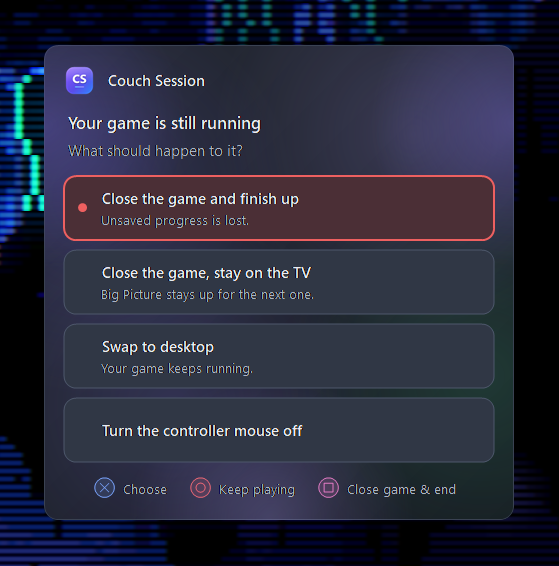
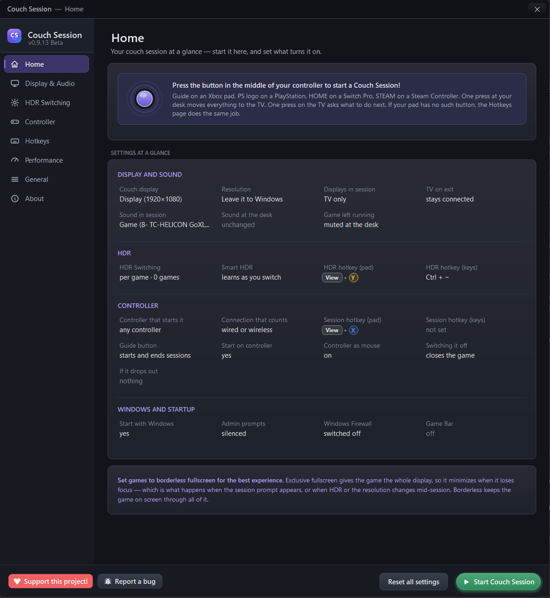
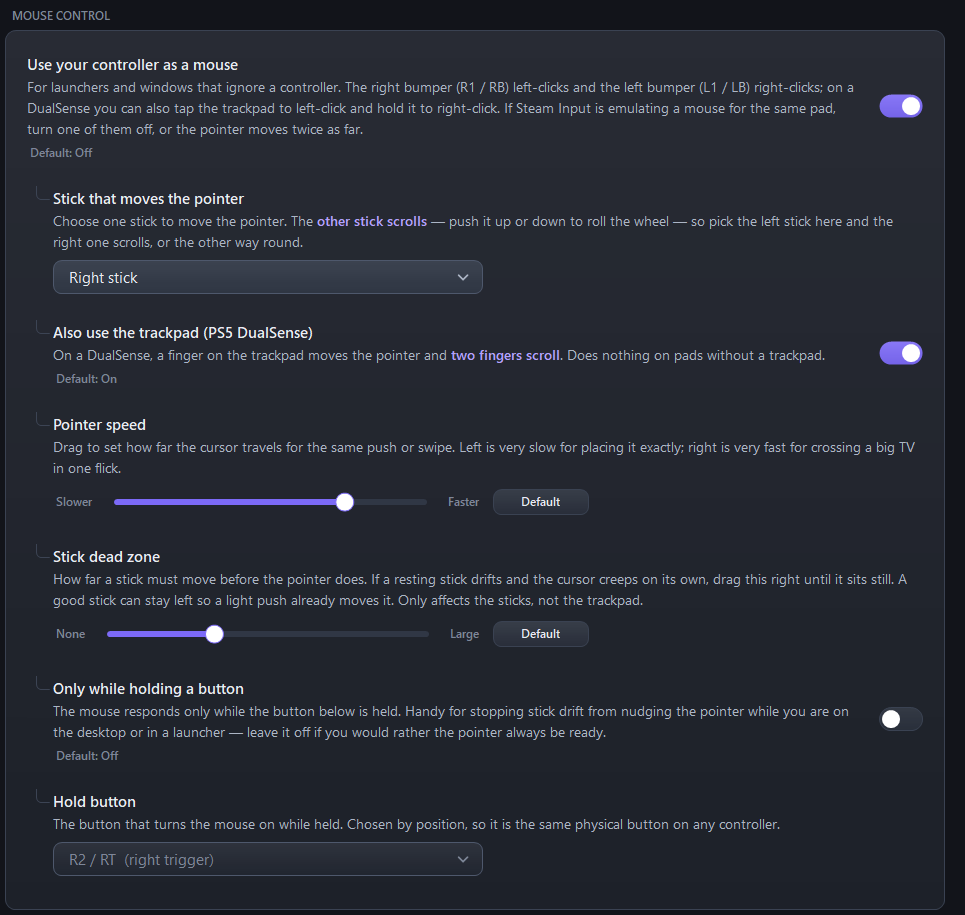

<div align="center">

# 🛋️ Couch Session

**Your gaming PC on the TV, and back again, with one press.**

[](https://github.com/Sub-Wolfer/couch-session/releases/latest)
[](LICENSE)
[](#-what-you-need)
[](#-a-word-about-beta)

</div>

---

You want to play on the television. That means changing your display, moving the sound, setting the
right resolution, turning HDR on, opening Big Picture — and then undoing all of it when you're done,
usually while wondering which window went where.

Couch Session does the whole round trip. One press out, one press back, everything exactly as you left
it.

<div align="center">
  
  <br>
  <em>Ending a session mid-game. Answered with the pad, from the sofa.</em>
</div>

---

## ✨ What it actually does

| | |
|---|---|
| 🖥️&nbsp;**Display** | Switches to your TV — on its own, or alongside your monitors — at the resolution and refresh rate you picked for it. Puts your desktop and its windows back afterwards. |
| 🔊&nbsp;**Sound** | Moves audio to the TV on the way out and back to your desk on the way in. |
| 🌈&nbsp;**HDR** | On for the whole session, or only while a game from your list is running. Off again when it closes. |
| 🎮&nbsp;**Controller** | Start and end sessions from the pad. Use it as a mouse for launchers that ignore controllers. Tested on Xbox and PS5 pads. |
| ⚡&nbsp;**Performance** | Power plan, Game Mode, game priority, and silencing notifications — most of it undone when the session ends. |
| 🔄&nbsp;**Updates** | Tells you when a new version exists and installs it with one click. |

---

## 🚀 Getting started

**1. Download and run it.** Grab `CouchSession.exe` from the
[latest release](https://github.com/Sub-Wolfer/couch-session/releases/latest). There's no installer
and no .NET to install — it's one file with everything inside.

**2. Pick your TV and your speakers.** Settings opens on first run. Go to **Display & Audio** and
choose them. Your TV doesn't need to be switched on to appear in the list — it's there, dimmed, marked
disconnected.

**3. Set a way to start a session.** On the **Hotkeys** page, record a keyboard combination, a
controller combination, or both. The PlayStation and Xbox Guide buttons work out of the box.

That's the whole setup. Everything else has a sensible default.

<div align="center">
  
  <br>
  <em>The Home page tells you what's set, what's wrong, and what's new.</em>
</div>

---

## 🎯 How you'll actually use it

**From your desk**, press your hotkey. The TV comes on, sound moves, Big Picture opens.

**From the sofa**, press the Guide button in the middle of your pad — the PlayStation logo or the Xbox
button. On the desktop it starts a session. Inside one, it asks what you want to do.

**When you're done**, the same button. If a game is still running you'll be asked whether to close it,
leave it running, or stay on the TV — and if closing it would lose unsaved progress, you're asked a
second time.

**Closing Big Picture** ends the session too. However you got to the TV, going back is one action.

---

## ⚙️ Every setting explains itself

No setting in this app is a bare label. Each one says what it does, what it costs, and what happens to
it when the session ends — because a switch you can't reason about is a switch you leave alone.

<div align="center">
  
</div>

---

## ⚙️ Settings that outlast the session

Most of what this app does is temporary — the power plan, notification silencing and game priority are
all put back when a session ends. A few settings aren't, and they're worth understanding before you
switch them on. **Every one of these is off until you turn it on**, and each says so on its own row.

### 👍 Recommended, and they stay on

🏎️ **Windows Game Mode** asks Windows to prioritise the game and hold back background work. Worth
having on. Couch Session switches it on and then leaves it alone — it's a Windows-wide preference, and
flipping it back off afterwards would fight anyone who'd turned it on themselves.

🎮 **Switch off the Xbox Game Bar** stops the Guide button opening the Game Bar over your game, which
is awkward from a sofa. Also worth having on, with one thing to know: it applies for the whole time
Couch Session is running rather than just during a session, and it takes background clip recording with
it. If Win+G has stopped working at your desk, this is why. Closing the app puts both back.

### ⚠️ Your call, and they lower your security

> 🔓 **User Account Control** and **Windows Defender Firewall** can both be switched off from the
> Performance page. **These reduce your PC's security**, and they aren't tied to a session — they stay
> off until you turn them back on here.
>
> They exist because a UAC prompt appears on a secure desktop a controller cannot reach, and the
> firewall's "allow this app?" dialog needs a mouse and blocks a game's networking until it's answered.
> Both are dead ends when the only thing in your hand is a gamepad. If that isn't a trade you want,
> leave them alone — nothing else in the app depends on them.

---

## 🕹️ Controllers

**Tested with:** Xbox controllers and the PS5 DualSense.

Anything else Windows recognises should work — the app reads standard HID and XInput rather than
anything vendor-specific, and buttons are handled by position so a combination set on one pad is the
same physical buttons on another. But "should work" is not "tested", and right now those two are the
only ones that have been. If you have a DualShock 4, a Switch Pro controller, an 8BitDo or anything
else, [a quick report](https://github.com/Sub-Wolfer/couch-session/issues) either way is genuinely
useful.

No extra software is needed for any of them.

Your controller is **never taken over** — it's opened for reading only and never exclusively, so it
runs alongside Steam Input, DS4Windows and games rather than competing with them.

Nothing here injects code, hooks another process, reads another process's memory, or synthesises
gamepad input. That's a deliberate design rule, not an accident: it's what keeps the app clear of
anti-cheat. It reads HID devices directly and asks Windows about its own windows, and that's all.

---

## 💻 What you need

- **Windows 11**, which is what it's developed and tested against. Windows 10 works — the only
  difference you'll notice is square window corners instead of rounded ones.
- **Steam**, since a session opens Big Picture.
- Nothing else. No runtime, no installer, no admin rights unless you choose the two security settings
  above.

Settings live in `%AppData%\CouchSession`. Nothing is written anywhere else.

---

## 🧪 A word about beta

This is version 0.9.x and it's in daily use, but it hasn't been through many hands yet. Bug reports
are genuinely useful right now.

The fastest route is the **Report a bug** button in the app's footer — it gathers the log from
`%AppData%\CouchSession\couchsession.log` alongside your settings, which is almost always where the
answer is hiding. Otherwise [open an issue](https://github.com/Sub-Wolfer/couch-session/issues) and
attach that log.

---

## 🔨 Building it yourself

You'll need the [.NET 8 SDK](https://dotnet.microsoft.com/download/dotnet/8.0).

```bash
git clone https://github.com/Sub-Wolfer/couch-session
cd couch-session
dotnet build -c Release
```

For the single-file executable a release ships as:

```bash
dotnet publish -c Release
```

<details>
<summary><strong>A note on the console button artwork</strong></summary>

<br>

The PlayStation and Xbox button images aren't in this repository — both marks are trademarks and
can't be redistributed here, so the app draws its own approximations instead. That's the shipping
behaviour and nothing is missing without them.

If you have the rights to real artwork, drop `ps-button.png` and `xbox-button.png` beside the `.csproj`
as square transparent PNGs, 128px or larger, and they'll be embedded automatically.

</details>

<details>
<summary><strong>Regenerating the app icon</strong></summary>

<br>

The icon is drawn by the app itself rather than maintained as a separate file, so there's one
definition of the mark. To rebuild `CouchSession.ico` from it:

```bash
CouchSession.exe --write-icon
```

Then build again to embed the result.

</details>

---

## 📄 Licence

MIT — see [LICENSE](LICENSE). Do what you like with it.

<div align="center">
<br>
<sub>Built for the ten feet between the desk and the sofa.</sub>
</div>
